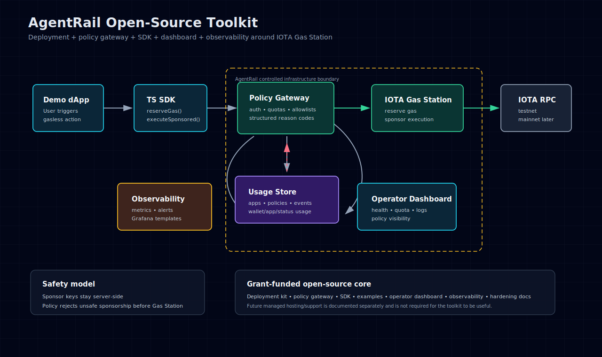
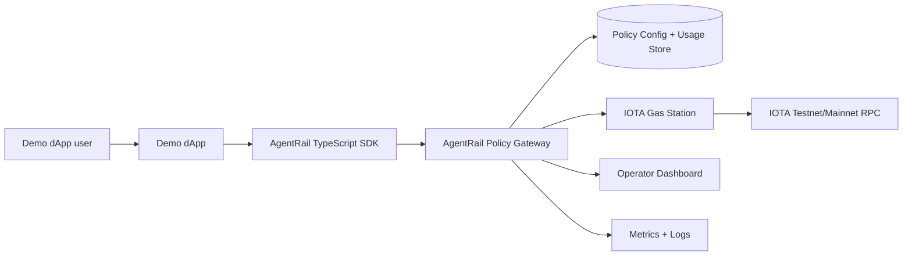

# AgentRail

**IOTA-native infrastructure for agent-safe sponsored execution.**

[](#agentrail)
[](https://proofdrop.xyz)
[](LICENSE)

AgentRail is the new identity for the agent-safe IOTA execution stack built on
the original IOTA GasKit sponsorship toolkit: self-hostable Gas Station
integration plus agent wallets, signer references, transaction manifests,
policy controls, receipts, contract workflows, MCP/A2A surfaces, and
standards-compatible payments.

It is designed for teams building IOTA dApps, agent workflows, enterprise
automation, identity products, notarization systems, RWA/product-passport apps,
supply-chain tools, games, wallets, and demos where users or agents should not
need to acquire IOTA tokens before experiencing product value.

> **Open-source scope:** this repository is the self-hostable toolkit. A future managed service may offer hosting, support, SLAs, and enterprise onboarding, but the core project remains independently deployable, inspectable, forkable, licensed open source, and useful without hosted AgentRail.

## Migration status

This fork was created from `https://github.com/0xCozart/iota-gaskit` to move
the AgentRail direction into the actual sponsorship toolkit codebase instead of
keeping the implementation plan in `/home/sacred/code/agents`.

Canonical GitHub repo: `https://github.com/0xCozart/agentrail`

Start with [`docs/agentrail/execution-entry.md`](docs/agentrail/execution-entry.md)
to begin actual product implementation. Read
[`docs/agentrail/migration-plan.md`](docs/agentrail/migration-plan.md)
before changing package names, wallet behavior, MCP tools, gateway policy, or
remote publishing. Existing sponsorship behavior remains the foundation;
agent-specific behavior should be added in vertical slices.

Current public execution entry:
[`docs/agentrail/execution-entry.md`](docs/agentrail/execution-entry.md)
and [`docs/agentrail/execution-slices.md`](docs/agentrail/execution-slices.md).
Private Codex goals, local handoffs, and scratch planning notes are kept out of
the open-source surface.

## One-line pitch

AgentRail gives AI agents a safe IOTA execution stack: sponsored gas,
policy controls, signer references, manifests, receipts, contracts, and
operator visibility.

## Start Here: One Adoption Path

The public center of gravity is agent-safe sponsored execution for IOTA.
The first developer path is intentionally narrow:

```bash
npm install
npm run smoke:paid-mcp-tool
npm run smoke:package-paid-mcp-consumer
```

That path proves a local paid MCP-style tool call through the SDK and mock
policy gateway, using a manifest, scoped signer reference, sponsorship policy,
payment gating, receipts, denial handling, failed-payment withholding, and
redacted output. The package consumer smoke also packs the public workspace
packages into local tarballs, installs them into a fresh temporary consumer
project, and imports package root entrypoints only.

This is local adoption proof, not a production claim. It does not prove npm
registry publication, live IOTA/testnet execution, live payment settlement,
custody, marketplace operation, or public A2A hosting. Those remain separate
operator gates.

## Why AgentRail Exists

The official IOTA Gas Station component solves the core sponsored-transaction primitive: an application can sponsor gas fees for its users.

Production teams and agent operators still need the surrounding developer,
operator, and safety layer:

- repeatable local and testnet deployment flows;
- app-level credentials and sponsorship budgets;
- package/function allowlists;
- wallet request limits and denylists;
- structured policy rejection reasons;
- request, execution, and spend visibility through sanitized gateway decision events;
- SDK helpers and backend integration examples;
- dashboard views for app keys, usage, health, and errors;
- sponsor-wallet, Redis, reverse-proxy, and KMS hardening guidance;
- reproducible demos and documentation;
- agent-created wallets represented by scoped signer references instead of raw
  seeds;
- manifest, receipt, identity, and contract rails for agent actions;
- a real IOTA testnet sponsored execute script with documented public transaction digest evidence.

AgentRail packages those pieces into a reusable open-source toolkit so every IOTA
builder or agent developer does not have to recreate the same safety and
operations layer.

## What Is In This Repo Now

This repository currently contains the open-source AgentRail toolkit: a tested
policy gateway, TypeScript SDK, local demo flows, integration examples,
deployment templates, security docs, observability foundations, and documented
IOTA testnet sponsored-execution evidence.

It also contains the first AgentRail implementation slices:
signer-reference-first account primitives, transaction manifests, pure agent
policy evaluation, a local mock sponsorship gateway, SDK sponsored actions,
MCP-shaped sponsorship tools, receipt state, local Move escrow/receipt state
contracts, a deterministic local agent-to-agent escrow demo, and local Agent
Profile schema validation with fixture resolution, IOTA Names/Identity adapter
interfaces, an opt-in IOTA Names live resolution smoke, capability policy checks,
x402/AP2/A2A standards bridge helpers,
local pay-per-call, data-license, service-bounty, reputation-receipt, and
subscription workflows, bounded local IOTA Identity verification cache helpers,
local VC trust-policy evaluation, an opt-in IOTA Identity live proof harness,
and local A2A well-known Agent Card response proof plus local/mock A2A
signed Agent Card proof, local public JWKS and static discovery bundle
helpers, static discovery artifact writer and validator, local static
discovery loopback host smoke, static hosting review packet writer,
task/message operation helpers, a local A2A HTTP-shaped boundary, a loopback
HTTP server smoke proof,
and a local read-only marketplace evidence model.

Some production surfaces remain planned roadmap work, including the full
dashboard UI, production persistence, production monitoring, package
publication, final demo assets, and all production custody/KMS behavior.

The repo currently includes:

- Apache-2.0 license;
- contribution and security policies;
- issue and pull request templates;
- policy reason-code/shared type scaffold;
- policy gateway decision engine scaffold with tests and a local policy simulation endpoint;
- TypeScript SDK scaffold with tests;
- demo app local integration scaffold and backend example scaffolds;
- sanitized policy gateway decision events, an in-memory local usage read model, a file-backed JSONL event-store foundation, and an authenticated local operator usage API foundation for observability;
- safe Gas Station config template;
- policy YAML example;
- architecture diagram and architecture docs;
- threat model and production hardening docs;
- reviewer checklist and demo script;
- agent escrow demo showing gateway approval, verifier release, receipt output,
  and over-budget policy denial without live IOTA calls;
- agent profile schema validation for required fields, revoked/expired states,
  unsupported versions, and secret-field rejection;
- local profile resolution through the SDK, mock-tested IOTA Names/Identity
  adapter interfaces, bounded identity verification cache helpers, and pure
  capability policy checks.
- local marketplace read model for provider labels, policy compatibility,
  receipt access control, and dispute evidence bundles without production
  marketplace operation.
- non-networked product-status, launch-readiness, and operator live-gate
  reports that separate local proof from live/testnet, publication, public A2A,
  payment, marketplace, custody, and safety blockers, plus an opt-in redacted
  JSON handoff artifact for operator live-gate review.

## Current proof status

The current scaffold verifies successfully locally:

```bash
npm install
npm run verify:fast
npm run verify:local
```

Latest local verification and prior live proof:

- `npm test`: 420 deterministic TypeScript tests passed locally after Slice 4.27.
- `npm run contracts:test`: 33 Move escrow/receipt/pay-per-call/data-license/service-bounty/reputation-receipt/subscription contract tests passed locally.
- `npm run typecheck`: passed locally.
- `npm run smoke:local`: deterministic local gateway smoke passed locally, including policy simulation, sanitized event, local usage read-model, file-backed usage event-store replay, and authenticated local operator usage API checks.
- `npm run smoke:demo-dapp`: deterministic local demo dApp smoke passed locally.
- `npm run smoke:demo-browser`: deterministic local browser-wrapper smoke passed locally.
- `npm run smoke:agent-escrow`: deterministic local agent-to-agent escrow smoke passed locally.
- `npm run smoke:paid-mcp-tool`: deterministic local paid MCP-style tool smoke passed locally.
- `npm run smoke:package-paid-mcp-consumer`: opt-in local tarball consumer
  proof passed locally for the canonical paid MCP-style tool flow using public
  package root entrypoints only.
- `npm run smoke:data-license`: deterministic local data-license smoke passed locally.
- `npm run smoke:service-bounty`: deterministic local service-bounty smoke passed locally.
- `npm run smoke:reputation-receipt`: deterministic local reputation-receipt smoke passed locally.
- `npm run smoke:subscription`: deterministic local subscription smoke passed locally.
- `npm run smoke:a2a-well-known`: deterministic local A2A Agent Card discovery response smoke passed locally.
- `npm run smoke:a2a-signed-card`: deterministic local A2A signed Agent Card smoke passed locally.
- `npm run smoke:a2a-task-message`: deterministic local A2A task/message operation smoke passed locally.
- `npm run smoke:a2a-http`: deterministic local A2A HTTP boundary smoke passed locally.
- `npm run smoke:a2a-local-server`: deterministic loopback A2A server smoke passed locally.
- `npm run smoke:marketplace-read-model`: deterministic local marketplace
  access-control and dispute-evidence smoke passed locally.
- `npm run smoke:iota-names-live -- --report <ignored-json-path>`: opt-in
  configured IOTA Names GraphQL resolution smoke exists; the missing-config
  blocker path is locally tested and a passing live run writes a sanitized
  ignored report before live proof gates can mark Names ready.
- `npm run readiness:testnet:example`: deterministic example testnet-readiness preflight passed locally.
- `npm run proof:testnet-digest`: deterministic non-networked check confirms
  the documented public testnet digest evidence is present in repo docs.
- `npm run proof:testnet-digest:live`: opt-in read-only IOTA testnet digest
  lookup exists; it does not spend gas or use sponsor credentials.
- `npm run proof:a2a-public-readiness`: deterministic non-networked A2A
  public-readiness gate reports local proof, local authenticated extended-card
  access, local public JWKS serving, local static discovery bundle generation,
  local static discovery artifact writing and validation, local static
  discovery loopback host smoke, local static hosting review, local loopback streaming, local push
  notification configuration, local injected push delivery, local opt-in push
  HTTP transport, local callback URL admission hardening, callback host
  allowlisting, local retry/attempt observability, local durable attempt
  evidence, local delivery queueing, a local injected-transport worker, public
  hosting inputs, redacted public discovery report classification, public push
  delivery structured-report classification, and external conformance
  structured-report blockers.
- `npm run a2a:write-static-discovery-bundle`: opt-in local artifact writer for
  already-signed public Agent Card and public JWKS JSON; it writes canonical
  `.well-known` files and a sanitized manifest but does not deploy or prove
  public A2A hosting.
- `npm run a2a:check-static-discovery-bundle`: opt-in local pre-hosting check
  for generated static discovery artifacts; it validates local files and
  manifest metadata without fetching public endpoints or proving public
  hosting.
- `npm run smoke:a2a-static-discovery-local`: opt-in loopback smoke for a
  generated static discovery directory; it serves the validated `.well-known`
  files locally with manifest-declared headers and fetches them back without
  proving public hosting.
- `npm run a2a:write-static-hosting-review`: opt-in non-networked review
  packet for a generated static discovery directory; it records canonical
  public paths, required headers, command order, operator input names, and
  proof boundaries without proving public hosting or public discovery.
- `npm run a2a:write-public-proof-plan`: opt-in non-networked public A2A proof
  plan writer; it emits redacted command order, blocker codes, and operator
  input names without contacting public endpoints.
- `npm run smoke:a2a-public-discovery`: opt-in public A2A Agent Card and JWKS
  discovery smoke exists for operator-approved public HTTPS configuration; it
  can emit a structured discovery report for readiness review, is not part of
  local verification, and does not prove external conformance or public push
  delivery.
- `npm run verify:fast`: deterministic fast iteration profile for build,
  TypeScript tests, docs check, secret scan, and non-networked status gates.
- `npm run proof:verification-profiles`: deterministic non-networked profile
  audit confirms `verify:fast` stays bounded and `verify:local` remains the
  full release/reviewer gate.
- `npm run pack:check`: workspace package dry-runs completed locally.
- `npm run smoke:package-install`: deterministic local tarball install/import
  smoke passed for 11 public workspace packages.
- `npm run proof:product-status`: deterministic non-networked product-status
  audit reports local proof gates separately from live, production,
  publication, marketplace, custody, A2A hosting, payment, and device-safety
  blockers.
- `npm run proof:launch-readiness`: deterministic non-networked
  launch-readiness evidence matrix maps roadmap areas to source evidence,
  local commands, blocker codes, and next gates.
- `npm run proof:operator-gates`: deterministic non-networked operator
  runbook classifies live/testnet, publication, public A2A, payment,
  marketplace, custody, and safety gates before execution.
- `npm run proof:roadmap-completion`: deterministic non-networked aggregate
  audit combines product-status, launch-readiness, and operator live-gate state
  into a redacted roadmap completion artifact; it does not contact live
  services or clear any blocked proof gate.
- `npm run operator:write-live-gate-report`: writes the same redacted
  non-networked operator-gate classification to an ignored local JSON artifact.
- `npm run gas-station:runtime-preflight`: non-networked runtime preflight for
  either the default local Docker Gas Station path or explicit
  `AGENTRAIL_GAS_STATION_RUNTIME_MODE=managed-upstream`; it does not start
  containers, contact IOTA services, or reserve gas.
- `npm run gas-station:docker-direct -- --dry-run`: local-only sanitized direct
  Docker plan for starting Redis and Gas Station when Compose is unavailable;
  `--execute` is opt-in because it may pull images and start containers.
- `npm run publish:dry-run`: opt-in npm publish dry-run completed locally for
  public workspaces; no package was published.
- Latest `npm run execute:testnet-demo`: real sponsored IOTA testnet execute succeeded through the local policy gateway and Gas Station; public digest `5qSeMePKyUWVf6e5AiQCZD4MNLe6dwTrcXzo7cXtN5Zg`. Earlier 2026-06-14 public digest evidence includes `Fc32GFCU95wUGs5iGjewJuMxxXwtRrjzLh3LUGrf85uf`, `FLdnYRUACAKQn8CwugEv1u6gYTh9jBr8rGMk2JZ2adsd`, and `6Fz2r2ARRo6fiQMUL4FkWuwU16ekEmKHvHbhLpF5DU6n`.
- secret-oriented scan over tracked project files is wired into `npm run secrets:scan` and `npm run verify:local`.

See `docs/testnet-attempts.md`, `docs/agentrail/product-status.md`,
`docs/agentrail/launch-readiness-evidence.md`,
`docs/agentrail/testnet-digest-proof.md`,
`docs/agentrail/a2a-public-readiness.md`,
`docs/agentrail/operator-live-gates.md`,
`docs/agentrail/verification-profiles.md`, and
`docs/reviewer-walkthrough.md` for exact evidence.

## External showcase dApps

### Gasless ProofDrop

[Gasless ProofDrop](https://proofdrop.xyz) is the standalone public M1 showcase dApp for AgentRail. It demonstrates a backend-owned sponsorship flow where a visitor claims a "AgentRail Launch Proof" badge without holding IOTA tokens. ProofDrop is kept in a [separate repository](https://github.com/0xCozart/ProofDrop) so the AgentRail core remains focused on the self-hostable toolkit.

Current role: external M1 showcase app for the AgentRail integration pattern. The hosted app runs at [proofdrop.xyz](https://proofdrop.xyz), safe mock verification remains available from a clean clone, and live execution has been proven through a configured AgentRail gateway plus self-hosted IOTA Gas Station.

ProofDrop live evidence:

- Source: [github.com/0xCozart/ProofDrop](https://github.com/0xCozart/ProofDrop)
- Target: `0xd35b2cda222b21fcc7b6c46b00a5a172023d3de1f20c94a5ac553e290cf5f032::proofdrop_badge::claim_proof_badge`
- Latest hosted digest: [`GRVtucGZkKZXsXG8HssCPGmRkWbiBom9NGWzJDcVspnF`](https://explorer.iota.org/txblock/GRVtucGZkKZXsXG8HssCPGmRkWbiBom9NGWzJDcVspnF?network=testnet)
- Remaining work: real browser wallet connection and user-owned signing. The current live flow uses a constrained server-side ephemeral demo signer.

## Target architecture





## Repository layout

```txt
apps/
  demo-dapp/              # Minimal local dApp CLI/browser wrapper
  policy-gateway-service/ # Runnable local policy gateway smoke service
packages/
  sdk/                    # TypeScript SDK scaffold
  policy-gateway/         # Policy decision engine scaffold
  shared-types/           # Shared policy/request/response types
  accounts/               # Agent account and signer-reference primitives
  manifest/               # Agent transaction manifest schema and validation
  registry/               # Agent Profile schema, validation, resolver, and adapters
  contracts-metadata/     # Versioned contract template metadata for policy
  marketplace/            # Read-only marketplace evidence views
  standards/              # x402/AP2/A2A standards bridge adapters
  mcp-server/             # MCP-shaped sponsorship tool facade
  receipts/               # Receipt and escrow state machine
contracts/
  escrow_v1/              # Local Move escrow state contract
  receipt_v1/             # Local Move receipt state contract
  pay_per_call_v1/         # Local Move paid tool-call state contract
deploy/
  docker-compose/         # Local deployment templates
  gas-station/            # Safe Gas Station config templates
docs/
  agentrail/          # Public agentic migration plan, roadmap, safety, status, and slices
  architecture.md
  demo-script.md
  deployment.md
  product-requirements.md
  reviewer-walkthrough.md
  observability.md
  policy.md
  production-hardening.md
  quickstart.md
  reviewer-checklist.md
  sdk.md
  threat-model.md
  testnet-readiness.md
examples/
  agent-escrow/           # Local agent-to-agent escrow demo
  a2a-signed-card/        # Local A2A signed Agent Card proof demo
  a2a-task-message/       # Local A2A task/message operation demo
  a2a-http/               # Local A2A HTTP-shaped boundary demo
  a2a-local-server/       # Local A2A loopback server smoke demo
  paid-mcp-tool/           # Local paid MCP-style tool demo
  nextjs-api-route/
  node-backend/
  policies/
```

## Packages

The monorepo root is marked `private` to prevent accidental publication of the
workspace root. The current prerelease package set is published to npm under
`@sacredlabs/agentrail-*` with the requested `next` tag because npm blocked
creation of the shorter `@agentrail` org scope pending support review. npm also
currently exposes `latest=0.0.0-prerelease` for this first published package
set after rejecting `latest` tag deletion. See
[`docs/agentrail/package-release-strategy.md`](docs/agentrail/package-release-strategy.md).

Package release evidence now includes package READMEs, public prerelease
publish metadata (`access=public`, `tag=next`), observed registry dist-tags
(`next` and registry-retained `latest` both pointing at `0.0.0-prerelease`),
map-free packed artifacts, local `npm pack --dry-run` verification, local
tarball install/import smoke, a local tarball paid MCP consumer smoke, an
opt-in package-publication readiness gate, an opt-in `npm publish --dry-run`
gate, real npm publication, and registry install/import proof for publishable
packages.

Do not treat any future namespace rename as package-publication-ready until
dry-run pack and publish checks, local tarball consumer proof, README package
names, lockfiles, npm account ownership, provenance decisions, and registry
credentials are reviewed in a dedicated release slice.

Dry-run package checks:

```bash
npm run pack:check
npm run smoke:package-install
npm run smoke:package-paid-mcp-consumer
npm run proof:package-publication-readiness
npm run publish:dry-run
```

`npm run publish:dry-run` builds first and then invokes npm's dry-run publish
path with `npm publish --dry-run --tag next --access public` for every public
workspace package.

Do not run a real `npm publish` without explicit operator approval and registry credentials handled outside the repo.


### `@sacredlabs/agentrail-shared-types`

Shared TypeScript types for policy decisions, policy reason codes, sponsorship policy, and request context.

### `@sacredlabs/agentrail-policy-gateway`

Policy decision scaffold for validating app status, credentials, daily limits,
gas budget, wallet denylist, package allowlist, function allowlist, and
agent contract-template allowlists.

Current tests cover:

- `AUTH_MISSING`
- `AUTH_INVALID`
- `APP_DISABLED`
- `APP_DAILY_REQUEST_LIMIT_EXCEEDED`
- `GAS_BUDGET_TOO_HIGH`
- `PACKAGE_NOT_ALLOWED`, including missing package metadata when an allowlist is configured
- `FUNCTION_NOT_ALLOWED`, including missing function metadata when an allowlist is configured
- `WALLET_DENIED`
- valid sponsorship request
- agent action policy approval by contract template id/version
- unknown raw packages denied when a template allowlist is configured
- mismatched template versions denied
- legacy raw package/function agent allowlists remaining compatible

### `@sacredlabs/agentrail-contracts-metadata`

Versioned contract template metadata registry for AgentRail policy
allowlists. The local registry currently covers escrow, receipt, pay-per-call,
data-license, service-bounty, reputation-receipt, and subscription template
metadata and pure checks for approved template/version, unknown package, and
mismatched version decisions. It does not deploy contracts, operate reputation
scoring, operate recurring billing, or prove live package addresses.

### `@sacredlabs/agentrail-sdk`

TypeScript client scaffold for dApp backends.

Current SDK supports request construction for:

- `simulatePolicy()`
- `reserveGas()`
- `executeSponsoredTransaction()`
- `requestSponsoredAction()`
- `openEscrow()`
- `callPaidTool()`
- `requestDataLicense()`
- `fulfillServiceBounty()`

It also includes typed error classes for auth, policy, and malformed-response failures.

## Documentation site

AgentRail includes a static docs site generated from the canonical Markdown files in this repo. The generated HTML is a hosting artifact; update the Markdown sources instead of editing `apps/docs-site/dist` directly.

Build the site:

```bash
npm run docs:build
```

Preview locally:

```bash
npm run docs:serve
```

Recommended static-host settings:

- build command: `npm run docs:build`
- output directory: `apps/docs-site/dist`
- Node version: `20`

## Agent access: start here

AI coding agents should start with the migration plan and repo-local AgentRail
skill:

```txt
docs/agentrail/migration-plan.md
```

```txt
skills/agentrail/SKILL.md
```

The skill is the fastest way to find the source map, safe verification ladder,
and sponsor-gas boundaries for this repo. The migration plan tells agents how
the AgentRail fork should evolve without duplicating or weakening existing
AgentRail sponsorship safety.

Recommended agent startup:

1. Read `AGENTS.md`.
2. Read `docs/agentrail/migration-plan.md`.
3. Read `skills/agentrail/SKILL.md`.
4. If `apex.workflow.json` exists, read it. If it does not, do not pretend Apex
   is configured.
5. For architecture/product context, read `docs/architecture.md`, `docs/overview.md`, and `README.md`.
6. Check `git status --short --branch` and preserve unrelated dirty work.

Useful skill entry points:

- SDK: `packages/sdk/src/client.ts`, `packages/sdk/src/types.ts`, `docs/sdk.md`
- Policy gateway: `packages/policy-gateway/src/`, `apps/policy-gateway-service/src/server.ts`, `docs/policy.md`
- Testnet readiness: `docs/testnet-readiness.md`, `docs/testnet-attempts.md`, `scripts/check-testnet-readiness.ts`
- Security: `docs/security/secrets.md`, `docs/security/sponsor-wallet.md`, `scripts/scan-secrets.ts`
- External showcase: [Gasless ProofDrop](https://proofdrop.xyz) and [github.com/0xCozart/ProofDrop](https://github.com/0xCozart/ProofDrop)

Default safe checks:

```bash
npm test
npm run typecheck
npm run smoke:local
npm run docs:check
npm run secrets:scan
```

Live commands such as `npm run execute:testnet-demo` contact live IOTA services
and consume sponsored testnet gas. Run them only with explicit operator intent,
operator-owned credentials configured outside the repo, passing local runtime
preflight, and a current passing upstream diagnostic report.

The hosted agent guide is `docs/agent-guide.md`.

## Roadmap

- Clean local deployment path with reviewed environment templates and health checks.
- Expanded policy controls for app credentials, wallet limits, package/function allowlists, denylists, quotas, and structured reason codes.
- TypeScript SDK release workflow, Next.js example, Node backend example, and publication-ready package artifacts.
- Usage event store, operator usage views, rejection views, health views, quota views, and basic export/log tooling.
- Hardening guide, observability docs, alerting templates, and final walkthrough assets.

## Quickstart preview

Install dependencies and run the current scaffold checks:

```bash
npm install
npm test
npm run typecheck
npm run smoke:local
```

For live proof, configure the policy gateway and Gas Station with
operator-owned testnet credentials. Use the default local Docker path by
rendering the local Gas Station config, running
`npm run gas-station:runtime-preflight`, and starting Gas Station through
Compose or the direct Docker fallback. If an operator intentionally uses a
separately managed Gas Station at `GAS_STATION_URL`, set
`AGENTRAIL_GAS_STATION_RUNTIME_MODE=managed-upstream` outside committed files and
run the same preflight. In both modes, run `npm run diagnose:gas-station --
--report tmp/agentrail/testnet-upstream-diagnostic.json`, then run
`npm run execute:testnet-demo` only with explicit operator intent. The execute
command is intentionally opt-in, self-checks those preconditions before
reserve/execute, and is excluded from CI because it contacts live services and
consumes sponsored testnet gas.

## Security posture

AgentRail is designed to fail closed and prioritize sponsor-wallet safety.

Never commit:

- sponsor private keys;
- IOTA wallet mnemonics or exported keypairs;
- Gas Station bearer tokens;
- app API keys;
- JWT/session secrets;
- Stripe/Resend/Supabase credentials;
- local `.env` files or local databases.

See:

- `SECURITY.md`
- `docs/threat-model.md`
- `docs/production-hardening.md`
- `docs/observability.md`
- `docs/security/sponsor-wallet.md`
- `docs/security/secrets.md`
- `docs/testnet-readiness.md`

## Open-source vs future managed service

The open-source toolkit is designed to remain useful to any IOTA builder who wants to self-host.

A future managed service may later provide:

- hosted AgentRail deployments;
- managed sponsor-wallet operations;
- paid support;
- enterprise onboarding;
- SLA-backed monitoring;
- compliance exports.

Those managed-service features are separate from the self-hostable open-source core and are not part of the public
open-source package.

## License

Apache-2.0. See `LICENSE`.

## Contributing

See `CONTRIBUTING.md` and `CODE_OF_CONDUCT.md`.
