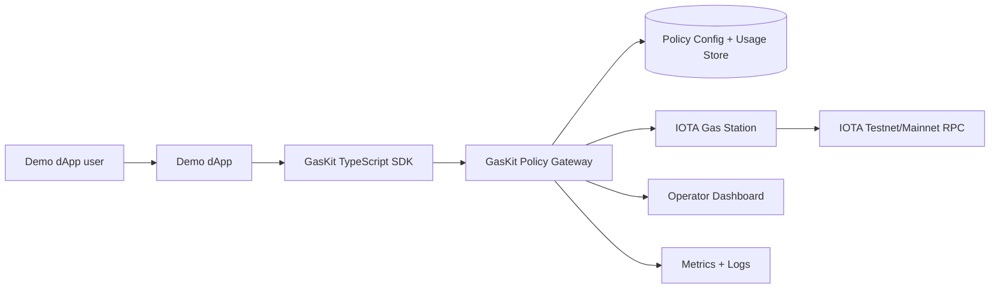

# IOTA GasKit

**Open-source infrastructure toolkit for gas-sponsored IOTA transactions.**

IOTA GasKit helps IOTA builders deploy, secure, monitor, and integrate sponsored-transaction infrastructure around the official IOTA Gas Station component.

It is designed for teams building IOTA dApps, enterprise workflows, identity products, notarization systems, RWA/product-passport apps, supply-chain tools, games, wallets, and hackathon demos where users should not need to acquire IOTA tokens before experiencing product value.

> **Grant scope:** this repository is the open-source toolkit. A future managed service may offer hosting, support, SLAs, and enterprise onboarding, but the grant-funded core remains independently deployable, inspectable, forkable, and useful without any hosted SaaS.

## One-line pitch

IOTA GasKit is the missing production-readiness layer around IOTA Gas Station: deployment templates, policy controls, quotas, app keys, SDK wrappers, dashboard visibility, observability, and hardening docs.

## Why GasKit exists

The official IOTA Gas Station component solves the core sponsored-transaction primitive: an application can sponsor gas fees for its users.

Production teams still need the surrounding operator and developer layer:

- repeatable local and testnet deployment flows;
- app-level credentials and sponsorship budgets;
- package/function allowlists;
- wallet request limits and denylists;
- structured policy rejection reasons;
- request, execution, and spend visibility through sanitized gateway decision events;
- SDK helpers and backend integration examples;
- dashboard views for app keys, usage, health, and errors;
- sponsor-wallet, Redis, reverse-proxy, and KMS hardening guidance;
- grant-reviewable demos and documentation;
- a real IOTA testnet sponsored execute script with documented public transaction digest evidence.

GasKit packages those pieces into a reusable open-source toolkit so every IOTA builder does not have to recreate the same safety and operations layer.

## What is in this repo now

This repository is currently in **grant-readiness sprint** mode. It is a clean public scaffold informed by an external working GaaS proof-of-concept that demonstrated an Express gas sponsorship gateway, API-key auth, quota tracking, transaction logging, dashboard UI, Docker deployment shape, and monitoring assets.

Those prototype items are external evidence only. This public repo now includes a real testnet sponsored-transaction demo path, while still treating dashboard UI, production monitoring, production persistence, package publication, and final video assets as remaining milestone work.

The clean grant repo itself now includes:

- Apache-2.0 license;
- contribution and security policies;
- issue and pull request templates;
- grant scope and managed-service separation docs;
- policy reason-code/shared type scaffold;
- policy gateway decision engine scaffold with tests and a local policy simulation endpoint;
- TypeScript SDK scaffold with tests;
- demo app local integration scaffold and backend example scaffolds;
- sanitized policy gateway decision events, an in-memory local usage read model, a file-backed JSONL event-store foundation, and an authenticated local operator usage API foundation for observability;
- safe Gas Station config template;
- policy YAML example;
- architecture diagram and architecture docs;
- threat model and production hardening docs;
- grant milestone plan, reviewer checklist, and demo script.

## Current proof status

The current scaffold verifies successfully locally:

```bash
npm install
npm run grant:check
```

Latest local verification:

- `npm test`: 118 deterministic package/app/script/example/reviewer-doc/usage-store/operator-usage/readiness/package-publish/live-execute compatibility tests passed locally before this final grant-readiness polish.
- `npm run typecheck`: passed locally.
- `npm run smoke:local`: deterministic local gateway smoke passed locally, including policy simulation, sanitized event, local usage read-model, file-backed usage event-store replay, and authenticated local operator usage API checks.
- `npm run smoke:demo-dapp`: deterministic local demo dApp smoke passed locally.
- `npm run smoke:demo-browser`: deterministic local browser-wrapper smoke passed locally.
- `npm run readiness:testnet:example`: deterministic example testnet-readiness preflight passed locally.
- `npm run pack:check`: workspace package dry-runs completed locally.
- `npm run execute:testnet-demo`: real sponsored IOTA testnet execute succeeded through the local policy gateway and Gas Station; public digest `2Db6NiwZdR26JenPkWMFno7QgMePwhQ6rQQTA6jDJa7H`.
- secret-oriented scan over tracked project files is wired into `npm run secrets:scan` and `npm run grant:check`.

See `docs/milestone-0-proof.md` for exact evidence.

## Target architecture




## Repository layout

```txt
apps/
  demo-dapp/              # Minimal grant-demo dApp local CLI/browser wrapper
  policy-gateway-service/ # Runnable local policy gateway smoke service
packages/
  sdk/                    # TypeScript SDK scaffold
  policy-gateway/         # Policy decision engine scaffold
  shared-types/           # Shared policy/request/response types
deploy/
  docker-compose/         # Local deployment templates
  gas-station/            # Safe Gas Station config templates
docs/
  architecture.md
  demo-script.md
  deployment.md
  product-requirements.md
  continuation-brief-2026-04-26.md
  grant-application.md
  grant-milestones.md
  grant-scope.md
  milestone-0-proof.md
  reviewer-walkthrough.md
  observability.md
  policy.md
  production-hardening.md
  quickstart.md
  reviewer-checklist.md
  sdk.md
  threat-model.md
  testnet-readiness.md
examples/
  nextjs-api-route/
  node-backend/
  policies/
```

## Packages

The monorepo root is marked `private` to prevent accidental publication of the workspace root. Package-level publishing remains a later milestone action, but the current workspace packages now have package READMEs, public prerelease publish metadata (`access=public`, `tag=next`), map-free packed artifacts, and local `npm pack --dry-run` verification for publishable packages.

Dry-run package checks:

```bash
npm run pack:check
npm publish --dry-run --tag next --access public -w @iota-gaskit/shared-types -w @iota-gaskit/policy-gateway -w @iota-gaskit/sdk
```

Do not run a real `npm publish` without explicit operator approval and registry credentials handled outside the repo.


### `@iota-gaskit/shared-types`

Shared TypeScript types for policy decisions, policy reason codes, sponsorship policy, and request context.

### `@iota-gaskit/policy-gateway`

Policy decision scaffold for validating app status, credentials, daily limits, gas budget, wallet denylist, package allowlist, and function allowlist.

Current tests cover:

- `AUTH_MISSING`
- `AUTH_INVALID`
- `APP_DISABLED`
- `APP_DAILY_REQUEST_LIMIT_EXCEEDED`
- `GAS_BUDGET_TOO_HIGH`
- `PACKAGE_NOT_ALLOWED`, including missing package metadata when an allowlist is configured
- `FUNCTION_NOT_ALLOWED`, including missing function metadata when an allowlist is configured
- `WALLET_DENIED`
- valid sponsorship request

### `@iota-gaskit/sdk`

TypeScript client scaffold for dApp backends.

Current SDK supports request construction for:

- `simulatePolicy()`
- `reserveGas()`
- `executeSponsoredTransaction()`

It also includes typed error classes for auth, policy, and malformed-response failures.

## Grant milestones

Recommended Tier 2 grant ask: **$49,000**.

| Milestone | Budget | Outcome |
| --- | ---: | --- |
| M1 Deployment Kit and Demo | $10,000 | Clean local stack and sponsored transaction demo |
| M2 Policy Gateway and Quotas | $12,000 | App keys, quotas, wallet limits, package/function allowlists, reason codes |
| M3 SDK and Examples | $8,000 | TypeScript SDK, Next.js example, Node backend example |
| M4 Dashboard and Usage Tracking | $12,000 | Operator dashboard with app/wallet/rejection/usage views |
| M5 Hardening, Observability, Final Demo | $7,000 | Threat model, monitoring, alerts, hardening docs, final video |

See `docs/grant-milestones.md`. Reviewers can start with `docs/reviewer-walkthrough.md`.

## Quickstart preview

Install dependencies and run the current scaffold checks:

```bash
npm install
npm test
npm run typecheck
npm run smoke:local
```

For live proof, configure the local policy gateway and Gas Station with operator-owned testnet credentials, then run `npm run execute:testnet-demo`. The command is intentionally opt-in and excluded from CI because it contacts live services and consumes sponsored testnet gas.

## Security posture

GasKit is designed to fail closed and prioritize sponsor-wallet safety.

Never commit:

- sponsor private keys;
- IOTA wallet mnemonics or exported keypairs;
- Gas Station bearer tokens;
- app API keys;
- JWT/session secrets;
- Stripe/Resend/Supabase credentials;
- local `.env` files or local databases.

See:

- `SECURITY.md`
- `docs/threat-model.md`
- `docs/production-hardening.md`
- `docs/observability.md`
- `docs/security/sponsor-wallet.md`
- `docs/security/secrets.md`
- `docs/testnet-readiness.md`

## Open-source vs future managed service

The grant funds reusable public-good infrastructure. The open-source toolkit must remain useful to any IOTA builder who wants to self-host.

A future managed service may later provide:

- hosted GasKit deployments;
- managed sponsor-wallet operations;
- paid support;
- enterprise onboarding;
- SLA-backed monitoring;
- compliance exports.

Those managed-service features are not required for the grant MVP. See `docs/managed-service-roadmap.md`.

## License

Apache-2.0. See `LICENSE`.

## Contributing

See `CONTRIBUTING.md` and `CODE_OF_CONDUCT.md`.
