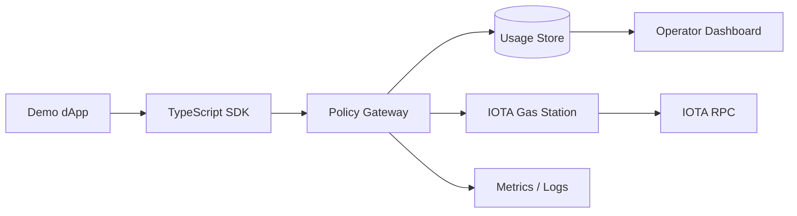

# Architecture

Vallum is intentionally split into small layers. The current implemented goal
is to let an app sponsor IOTA gas without putting sponsor-wallet risk directly
into frontend code or one-off backend glue.

Vallum keeps that foundation and adds a planned agent layer: account
creation through signer references, transaction manifests, identity/profile
checks, MCP/A2A tool surfaces, receipts, and contract workflows. Those additions
must route through the same policy and sponsor-wallet boundaries instead of
bypassing them.

The plain-English shape is:

```text
User action
  -> app backend
  -> Vallum SDK or Policy Gateway
  -> official IOTA Gas Station
  -> IOTA network
```

Planned agent flow:

```text
Agent action
  -> MCP/A2A adapter or agent SDK
  -> Agent manifest + signer reference
  -> Vallum policy gateway
  -> official IOTA Gas Station / IOTA contracts
  -> receipt and audit event
```

The app backend owns the user experience. Vallum owns app-level sponsorship checks. IOTA Gas Station owns sponsor gas reservation and sponsored execution. IOTA owns final transaction validation.

## Why This Architecture

### Keep Sponsor Secrets Away From Browsers

Browser and mobile code are public by default. Anything embedded there can be copied. A sponsor wallet or Gas Station bearer token must stay on a trusted backend. Vallum therefore treats browser flows as thin clients that call same-origin backend routes.

### Check Policy Before Spending Gas

The official Gas Station can sponsor transactions, but the app still needs to decide which requests deserve sponsorship. Vallum adds a policy gateway before the Gas Station so requests can fail closed on missing auth, unknown apps, blocked wallets, package mismatches, function mismatches, or gas-budget limits.

### Make Sponsorship Explainable

Operators need to know what happened without leaking secrets. Vallum emits sanitized decision events: app ID, operation, outcome, reason code, package/function metadata, wallet address, and safe request identifiers. It does not emit app keys, bearer tokens, raw transaction bytes, user signatures, or raw upstream error bodies.

### Separate Local Proof From Live Network Risk

Most docs and tests should run without live IOTA services, sponsor keys, Docker, Redis, or testnet funds. That makes review repeatable and keeps secrets local. Live testnet execution is documented separately because it contacts real services and spends sponsor gas.

### Stay Self-Hostable

The official IOTA Gas Station is a self-hosted building block. Vallum follows that model. The current project is an open-source toolkit and service foundation, not a closed managed sponsor service.

## Component Map




## Components

- Demo dApp: a small app used to prove the integration path locally.
- TypeScript SDK: a typed wrapper that app backends use instead of hand-writing HTTP calls.
- Vallum Policy Gateway: validates app credentials, package/function policy, wallet limits, gas budgets, and request shape before proxying to Gas Station.
- Usage Store: records sanitized decision events and usage aggregates for local proof and future dashboard work.
- IOTA Gas Station: the official sponsored-transaction component that manages sponsor-owned gas objects.
- IOTA RPC: the IOTA network endpoint used by Gas Station to submit or inspect transactions.
- Operator Dashboard: planned health, usage, policy, and rejection visibility built on the sanitized event foundation.

## Request Lifecycle

1. The user starts an action in the app.
2. The app backend builds or describes the intended transaction.
3. The backend calls Vallum, usually through the SDK.
4. Vallum authenticates the app key and checks sponsorship policy.
5. If the request is not allowed, Vallum returns a bounded rejection reason.
6. If the request is allowed, Vallum reserves sponsor gas through IOTA Gas Station.
7. The user signs the transaction payload.
8. Vallum executes the sponsored transaction path with the user signature and reservation.
9. Vallum emits sanitized decision events for usage and troubleshooting.

## Trust Boundaries

| Boundary | Why it exists | Vallum default |
| --- | --- | --- |
| Browser to backend | Browser code is inspectable and cannot protect sponsor secrets. | Keep app keys and Gas Station bearer tokens server-side. |
| Backend to Vallum | Apps need authenticated sponsorship, not open public spend. | Require app credentials before policy evaluation. |
| Vallum to Gas Station | The sponsor wallet can spend funded gas. | Apply allowlists, budgets, wallet controls, and bounded errors before proxying. |
| Vallum to logs/events | Observability is useful, but raw payloads can leak secrets. | Emit allowlisted sanitized fields only. |
| Local proof to live testnet | Local checks should be repeatable without funded credentials. | Keep live testnet commands separate from `verify:local`. |
| Agent runtime to signer | Agent runtimes should not receive raw seed/private-key material. | Return scoped signer references and require owner/agent context plus policy. |

## Why Not Call IOTA Gas Station Directly?

For experiments, a direct backend call can work. For an app, the direct path leaves repeated work and risk:

- every app has to invent its own auth boundary;
- package and function allowlists are easy to forget;
- wallet and quota controls drift across integrations;
- upstream errors may leak too much detail;
- operators have no consistent usage record;
- browser teams may accidentally expose sponsor credentials.

Vallum centralizes those concerns so a team can start from safer defaults.

## Local decision events and usage read model

The runnable local policy gateway can emit sanitized structured decision events through an optional `eventSink` callback. Events cover reserve/execute approvals, policy/auth rejections, and upstream failures. They include operational fields such as app ID, wallet address, package/function metadata, HTTP status, reason code, and Vallum transaction ID, but never include app API keys, upstream bearer tokens, raw request bodies, transaction bytes, user signatures, or raw upstream error bodies.

`apps/policy-gateway-service/src/usage.ts` provides a local in-memory usage read model that consumes those sanitized events and returns aggregate counts by operation, outcome, app ID, wallet address, and reason code. Missing app, wallet, and reason metadata is counted under `unknown`, recent event retention is explicitly bounded, and `maxRecentEvents: 0` can disable recent payload retention while keeping counters.

`apps/policy-gateway-service/src/usage-store.ts` provides a local file-backed JSONL event-store foundation. It appends only the same allowlisted sanitized event fields used by the in-memory read model, validates required and present optional event fields before storage/replay, tolerates missing files as empty stores, rejects malformed/corrupt event lines during replay without exposing raw corrupt content, and can replay into the usage read model. This is suitable for deterministic local smoke/proof and as a stepping stone toward a production durable store.

`GET /operator/usage` provides an opt-in authenticated local operator API over that usage snapshot when `GatewayConfig.operatorUsage` is configured. Env wiring uses `VALLUM_USAGE_EVENT_STORE_PATH` plus a separate `VALLUM_OPERATOR_USAGE_TOKEN`; the endpoint is absent by default, returns `Cache-Control: no-store`, and hides usage-store load failures behind bounded error responses without app keys, upstream bearer tokens, operator tokens, raw corrupt content, or file paths.

These local pieces are deterministic foundations for later dashboard/storage work, not a complete production usage database or authenticated operator dashboard yet.

See `docs/observability.md` for the current event contract, local read-model contract, and future production usage-store direction.
