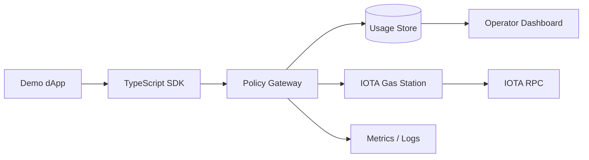

# Architecture

## Components

- IOTA Gas Station: official sponsored-transaction component.
- GasKit Policy Gateway: validates app credentials, policy, quotas, and metadata before proxying to Gas Station.
- GasKit Usage Store: stores sanitized app config, policy decisions, and usage events.
- TypeScript SDK: typed wrapper for dApp backends.
- Operator Dashboard: health, usage, policy, and rejection visibility.
- Demo dApp: reviewer-verifiable sponsored transaction flow.

## Local decision events and usage read model

The runnable local policy gateway can emit sanitized structured decision events through an optional `eventSink` callback. Events cover reserve/execute approvals, policy/auth rejections, and upstream failures. They include operational fields such as app ID, wallet address, package/function metadata, HTTP status, reason code, and GasKit transaction ID, but never include app API keys, upstream bearer tokens, raw request bodies, transaction bytes, user signatures, or raw upstream error bodies.

`apps/policy-gateway-service/src/usage.ts` provides a local in-memory usage read model that consumes those sanitized events and returns aggregate counts by operation, outcome, app ID, wallet address, and reason code. Missing app, wallet, and reason metadata is counted under `unknown`, recent event retention is explicitly bounded, and `maxRecentEvents: 0` can disable recent payload retention while keeping counters. It is a deterministic foundation for later dashboard/storage work, not a durable production usage store yet.

See `docs/observability.md` for the current event contract, local read-model contract, and future production usage-store direction.
